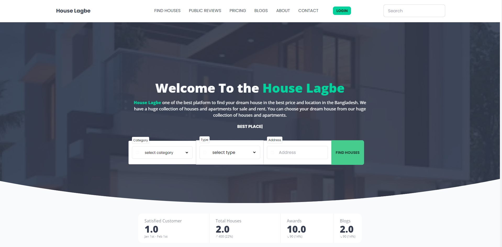

# House Rent Application In Redux Toolkit With TypeScript support

### Introduction

This is house rent application where users can listing their own rentable and saleable house and showing in this app and also can update and delete their own listing. Users can also see other users listing and can contact with them. Users can also see their own listing and can update and delete their own listing.
users can create account as customer or house holder. This is role based application where has 4 roles named as admin, customer, house holder and admin. Admin can manage all users and can see all users listing. Customer can see all users listing and can contact with them. House holder can create their own listing and can see their own listing and can update and delete their own listing.

### Features

Finally, done to created this application. Right now, here you can get some additional features like:

#### Global Features

- As any Users in the application can advanced filter with many additional information such as price, location, house type, house size, etc.
- As any Users in the Application can see the details of the house.
- As any Users in the Application can like and reports to the houses
- As any Users in the Application can read/like blogs and searching by name, filtering blogs by category
- As any Users in the Application can see the details of the blog.
- Users can create account with two roles named as customer and house holder with additional information.

After login in this application as Customer You will see:

#### Customer Features In Dashboard

- Their own dashboard with additional information.
- Their own booked houses
- Their own payments history
- Their own profile
- And public route called Feature Request & Bugs Report If you have any feature request or bugs report then you can send it to admin.
- get the interesting route called settings where you can change your password and also get a button for request as House Holder Account and can send request to Get the blogs authority to the admin/manager.
- As customer you will see all the houses and can see the details of the house and can book the house and can pay the house rent.
- After getting blogs authority you will get option to writing blogs and also can edit and delete your own blogs and also can active/inactive you blogs.
- In the profile you will change your profile picture and also updated your all the information except email.

After login in this application as House Holder You will see:

#### House Holder Features In Dashboard

- Their own dashboard with additional and advanced information.
- House holder can create their own listing and can see their own listing and can update and delete their own listing.
  - House holder can see their own bookings and can see their own payments history.
  - House holder can see their own profile and can change their profile picture and also updated their all the information except email.
  - House holder can see their own blogs and can edit and delete their own blogs and also can active/inactive their own blogs.
  - House holder can see their own settings and can change their password and also can request as customer account and can send request to Get the blogs authority to the admin/manager.
  - House holder can see their own feature request & bugs report and can send it to admin.

### Technology

```json
{
  "name": "client",
  "version": "0.1.0",
  "private": true,
  "dependencies": {
    "@reduxjs/toolkit": "^1.8.5",
    "@stripe/react-stripe-js": "^1.13.0",
    "@stripe/stripe-js": "^1.42.0",
    "@testing-library/jest-dom": "^5.14.1",
    "@testing-library/react": "^13.0.0",
    "@testing-library/user-event": "^13.2.1",
    "@types/axios": "^0.14.0",
    "@types/date-fns": "^2.6.0",
    "@types/jest": "^27.0.1",
    "@types/node": "^16.7.13",
    "@types/react": "^18.0.0",
    "@types/react-dom": "^18.0.0",
    "@types/react-modal-video": "^1.2.0",
    "@types/react-redux": "^7.1.24",
    "@types/react-slick": "^0.23.10",
    "@types/react-slider": "^1.3.1",
    "@types/react-toastify": "^4.1.0",
    "apexcharts": "^3.35.5",
    "axios": "^1.1.2",
    "cogo-toast": "2.0.1",
    "daisyui": "^2.31.0",
    "date-fns": "^2.29.3",
    "file-saver": "^2.0.5",
    "quill": "^1.3.7",
    "react": "^18.2.0",
    "react-apexcharts": "^1.4.0",
    "react-countup": "^6.3.2",
    "react-device-detect": "^2.2.2",
    "react-dom": "^18.2.0",
    "react-hook-form": "^7.36.1",
    "react-hot-toast": "^2.4.0",
    "react-icons": "^4.4.0",
    "react-image-lightbox": "^5.1.4",
    "react-lazy-load-image-component": "^1.5.5",
    "react-loading-skeleton": "^3.1.0",
    "react-modal-video": "^1.2.10",
    "react-query": "^3.39.2",
    "react-quilljs": "^1.3.3",
    "react-redux": "^8.0.4",
    "react-reveal": "^1.2.2",
    "react-router-dom": "6",
    "react-scripts": "5.0.1",
    "react-select": "^5.4.0",
    "react-share": "^4.4.1",
    "react-simple-scroll-up": "^0.2.3",
    "react-simple-star-rating": "^5.1.3",
    "react-slick": "^0.29.0",
    "react-slider": "^2.0.4",
    "react-spinners": "^0.13.5",
    "react-stars": "^2.2.5",
    "react-toastify": "^9.0.8",
    "react-tooltip": "^4.2.21",
    "react-typed": "^1.2.0",
    "slick-carousel": "^1.8.1",
    "styled-components": "^5.3.6",
    "sweetalert": "^2.1.2",
    "typescript": "^4.4.2",
    "universal-cookie": "^4.0.4",
    "web-vitals": "^2.1.0",
    "xlsx": "^0.18.5"
  },
  "scripts": {
    "start": "react-scripts start",
    "build": "react-scripts build",
    "test": "react-scripts test",
    "eject": "react-scripts eject"
  },
  "eslintConfig": {
    "extends": ["react-app", "react-app/jest"]
  },
  "browserslist": {
    "production": [">0.2%", "not dead", "not op_mini all"],
    "development": [
      "last 1 chrome version",
      "last 1 firefox version",
      "last 1 safari version"
    ]
  },
  "devDependencies": {
    "@types/file-saver": "^2.0.5",
    "@types/quill": "^2.0.9",
    "@types/react-lazy-load-image-component": "^1.5.2",
    "@types/react-stars": "^2.2.1",
    "@types/styled-components": "^5.1.26",
    "autoprefixer": "^10.4.12",
    "postcss": "^8.4.16",
    "tailwindcss": "^3.1.8"
  }
}
```

## Challenges

- I have faced challenge when we work with rkt query and try to replace our rtk query with react query because of the real time window focus fetching data and also try to use the react query with the rtk query.
- I have faced challenge when we work with the stripe payment gateway and try to implement the stripe payment gateway with the react and also try to implement the stripe payment gateway.
- Facing problem when Implementing SSLCOMMERZ bangladeshi popular payment gateway. when we redirect to the sslcommerz official link to checkout it did'nt redirect and get me the error called cors policy.

### Live Site

[House Rent Application](https://houselagbe.vercel.app/)

### Server Site Code

[Server Site Code](https://github.com/Ashik-Mahmud/rent-house-server)

## Preview Screenshot



> Thanks for reach out me on GitHub. If you have any question, please feel free to contact me.
